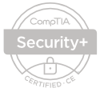

# Hey, I'm <a href="https://www.linkedin.com/in/marcdlc/" target="_blank">Marc De La Cruz</a>👋

This website will serve to document my adventure in the world of cybersecurity. Here, you'll find a list of projects that showcases the knowledge I've acquired and highlights the skills I've picked up along the way.

Over time, older projects will be replaced newer, more advanced ones, making it a constantly evolving platform recording my growth and advancement.

Each project is grouped into categories that roughly cover the vast domains of cybersecurity. They all follow a structured format, presenting a comprehensive view that includes the skills I demonstrate, the project scenario, goals and objectives, and the results I achieved. They come from a variety of sources, most of which are from certificate programs I've already completed or am currently in such as Coursera's <a href="https://www.credly.com/badges/2dd1e480-11bc-4096-ad6f-8760fb1b0fb4/public_url" target="_blank">Google Cybersecurity Program</a> and Correlation One's <a href="https://www.correlation-one.com/cybersecurity" target="_blank">Cybersecurity For All</a> training program. 

